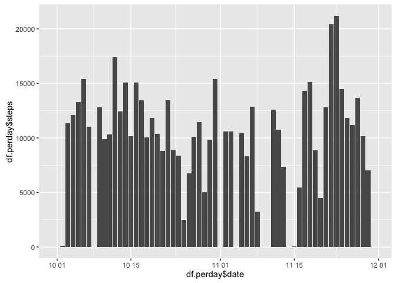
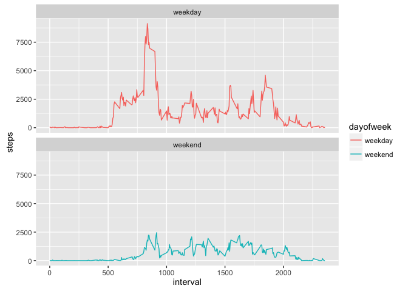

# Reproducible Research: Peer Assessment 1


## Loading and preprocessing the data


```r
df.raw <- read.csv("activity.csv")
df.raw$date <- as.Date(df.raw$date)
```


## What is mean total number of steps taken per day?

```r
library(dplyr)
```

```
## 
## Attaching package: 'dplyr'
```

```
## The following objects are masked from 'package:stats':
## 
##     filter, lag
```

```
## The following objects are masked from 'package:base':
## 
##     intersect, setdiff, setequal, union
```

```r
df.perday <- df.raw %>% group_by(date) %>% summarize(steps = sum(steps, na.rm=TRUE))

library(ggplot2)
p <- ggplot(df.perday, aes(df.perday$date, df.perday$steps))
p + geom_bar(stat="identity")
```



```r
ggsave("figure/plot1.png")
```

```
## Saving 7 x 5 in image
```

```r
df.mean <- df.raw %>% group_by(date) %>% summarize(steps.mean = mean(steps, na.rm=TRUE), steps.median=median(steps, na.rm=TRUE))
df.mean
```

```
## Source: local data frame [61 x 3]
## 
##          date steps.mean steps.median
##        (date)      (dbl)        (dbl)
## 1  2012-10-01        NaN           NA
## 2  2012-10-02    0.43750            0
## 3  2012-10-03   39.41667            0
## 4  2012-10-04   42.06944            0
## 5  2012-10-05   46.15972            0
## 6  2012-10-06   53.54167            0
## 7  2012-10-07   38.24653            0
## 8  2012-10-08        NaN           NA
## 9  2012-10-09   44.48264            0
## 10 2012-10-10   34.37500            0
## ..        ...        ...          ...
```


## What is the average daily activity pattern?

```r
df.interval <- df.raw %>% group_by(interval) %>% summarize(steps = mean(steps, na.rm=TRUE))

p <- ggplot(df.interval, aes(interval, steps))
p + geom_line()
```


```r
ggsave("figure/plot2.png")
```

```
## Saving 7 x 5 in image
```

```r
max.step <- max(df.interval$steps)
max.interval <- df.interval$interval[df.interval$step==max.step]
print(paste("5-minute interval with max steps is the",max.interval, "th",sep=" "))
```

```
## [1] "5-minute interval with max steps is the 835 th"
```


## Imputing missing values

```r
summary(df.raw)
```

```
##      steps             date               interval     
##  Min.   :  0.00   Min.   :2012-10-01   Min.   :   0.0  
##  1st Qu.:  0.00   1st Qu.:2012-10-16   1st Qu.: 588.8  
##  Median :  0.00   Median :2012-10-31   Median :1177.5  
##  Mean   : 37.38   Mean   :2012-10-31   Mean   :1177.5  
##  3rd Qu.: 12.00   3rd Qu.:2012-11-15   3rd Qu.:1766.2  
##  Max.   :806.00   Max.   :2012-11-30   Max.   :2355.0  
##  NA's   :2304
```

```r
df.na <- df.raw %>% filter(is.na(steps))
print(paste("NA's in data",dim(df.na)[1],sep=" "))
```

```
## [1] "NA's in data 2304"
```

```r
df.new = data.frame(df.raw)
for(i in 1:dim(df.new)[1]) {
  if (is.na(df.new$steps[i])) {
    df.new$steps[i] = 0 
    }
}

df.new.perday <- df.new %>% group_by(date) %>% summarize(steps = sum(steps, na.rm=TRUE))

p <- ggplot(df.new.perday, aes(date, steps))
p + geom_bar(stat="identity")
```


```r
ggsave("figure/plot3.png")
```

```
## Saving 7 x 5 in image
```

```r
df.new.mean <- df.new %>% group_by(date) %>% summarize(steps.mean = mean(steps, na.rm=TRUE), steps.median=median(steps, na.rm=TRUE))
df.new.mean
```

```
## Source: local data frame [61 x 3]
## 
##          date steps.mean steps.median
##        (date)      (dbl)        (dbl)
## 1  2012-10-01    0.00000            0
## 2  2012-10-02    0.43750            0
## 3  2012-10-03   39.41667            0
## 4  2012-10-04   42.06944            0
## 5  2012-10-05   46.15972            0
## 6  2012-10-06   53.54167            0
## 7  2012-10-07   38.24653            0
## 8  2012-10-08    0.00000            0
## 9  2012-10-09   44.48264            0
## 10 2012-10-10   34.37500            0
## ..        ...        ...          ...
```


## Are there differences in activity patterns between weekdays and weekends?

```r
l <- rep("weekday", times=dim(df.new)[1])
for(i in 1:dim(df.new)[1]) {
  dayofweek <- weekdays(df.new$date[i], abbreviate = TRUE)
  if (dayofweek=="土" | dayofweek == "日") {
    l[i] = "weekend" 
    }
}
df.new$dayofweek <- as.factor(l)

df.weekdays <- df.new %>% group_by(dayofweek,interval) %>% summarize(steps = sum(steps, na.rm=TRUE))

ggplot(df.weekdays, aes(interval, steps)) + geom_line(aes(color=dayofweek)) + facet_wrap(~ dayofweek ,ncol=1)
```



```r
ggsave("figure/plot4.png")
```

```
## Saving 7 x 5 in image
```

